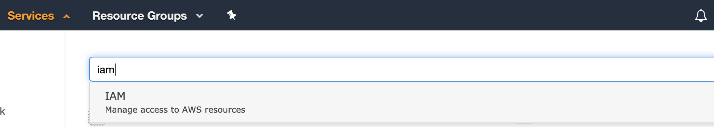
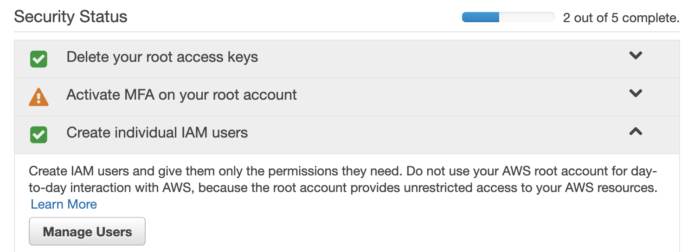
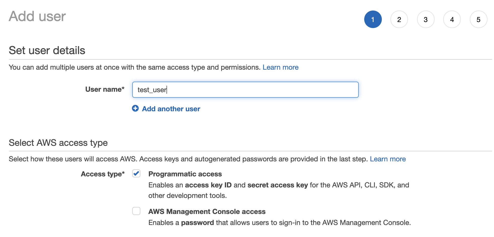
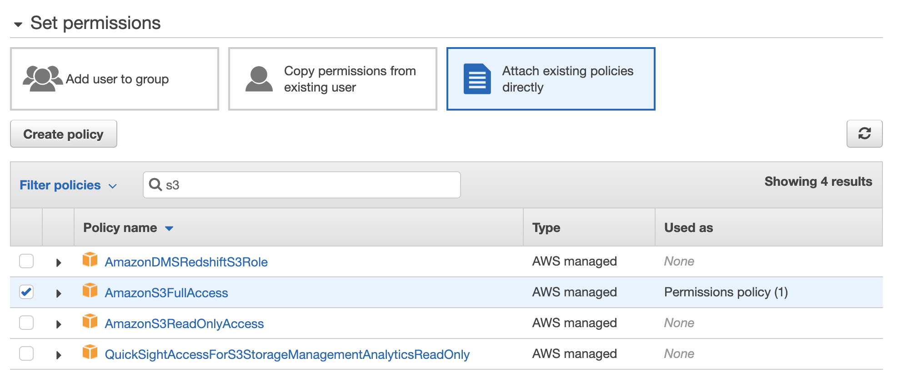

Amazon S3 File Crud operation using Spring Boot Java:

Prerequisites:
1. Log into the AWS Console.
2. Click on the Services menu in the top left of the screen, search for IAM, and click on the dropdown option that appears.

3. Under the Security Status heading, expand the Create individual IAM users option and click the Manage Users button.

4. Click the Add user button.
5. Enter the user's name for your new IAM user and check the box for <b>Programmatic access</b>.

6. AWS IAM User Details
Click the Next: Permissions button and then select Attach existing policies directly.
7. Type S3 into the search box and in the results, check the box for AmazonS3FullAccess.

8. Click the Next: Tags button, then click the Next: Review button.
9. Review the IAM user configuration and click the Create user button.
10. You'll be taken to a confirmation page, where you can copy out the Access key ID and Secret access key which are the credentials you'll use to access the AWS API through the Java SDK.

Amazon Java SDK Dependency:
<dependency>
<groupId>com.amazonaws</groupId>
<artifactId>aws-java-sdk-s3</artifactId>
<version>${version}</version>
</dependency>

Now, instead of just the S3 dependency, you could use aws-java-sdk, which is the entire SDK. There's a lot of dependencies in the entire SDK - 219, to be exact, so if you're only using S3, there's no need to download them all.
At this point, we are ready to automate the creation of buckets, uploading files to them and the deletion of buckets using Java!

Why S3 ?
S3 is Simple Storage Service provided by AWS. If your project has to deal with files then you will need the storage to store those files. and the best solution for that comes to mind is s3.
because -
1. It is scalable and reliable 
2. It supports versioning