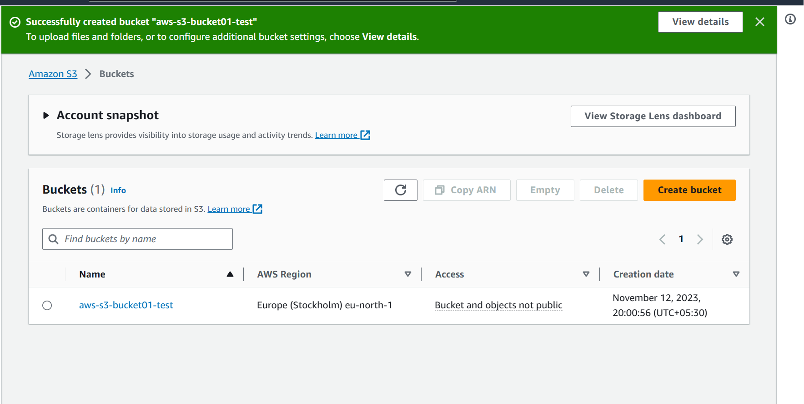
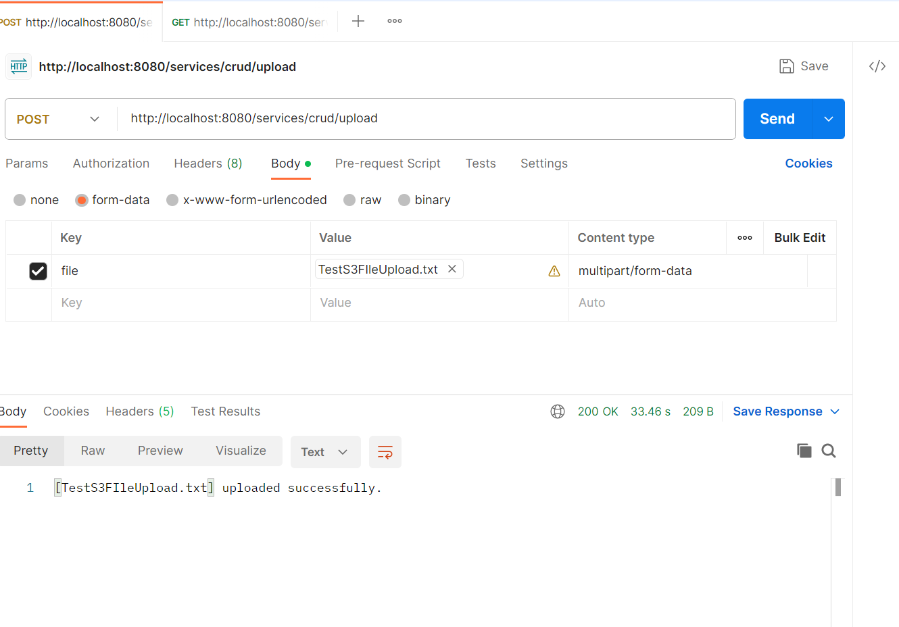
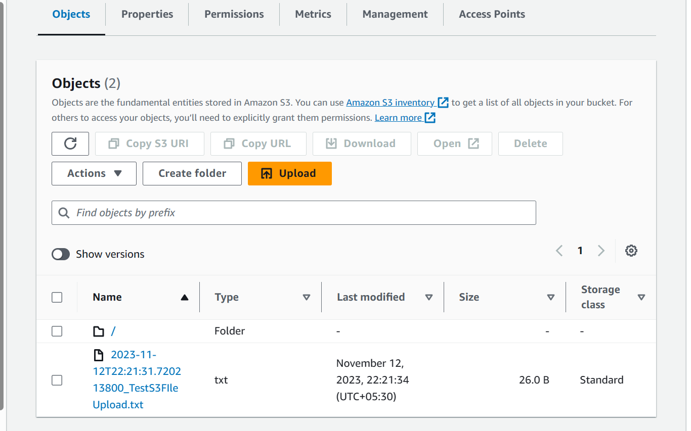
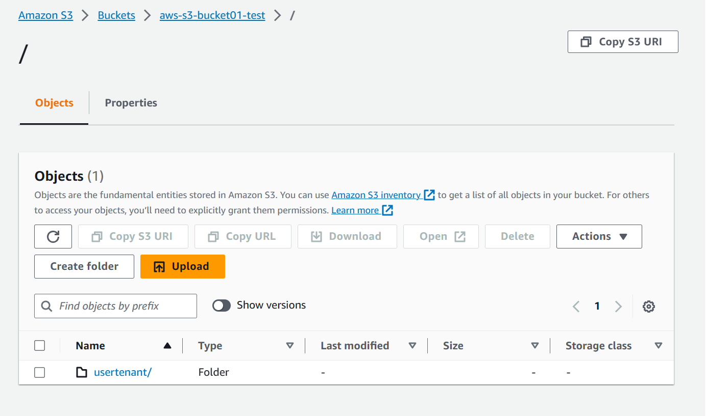
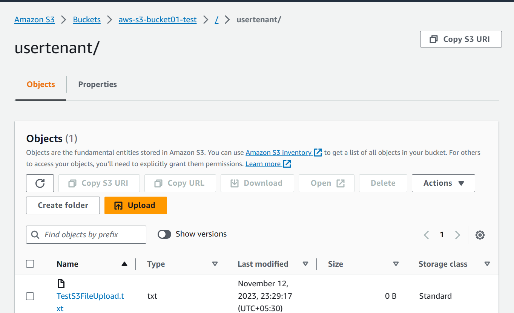
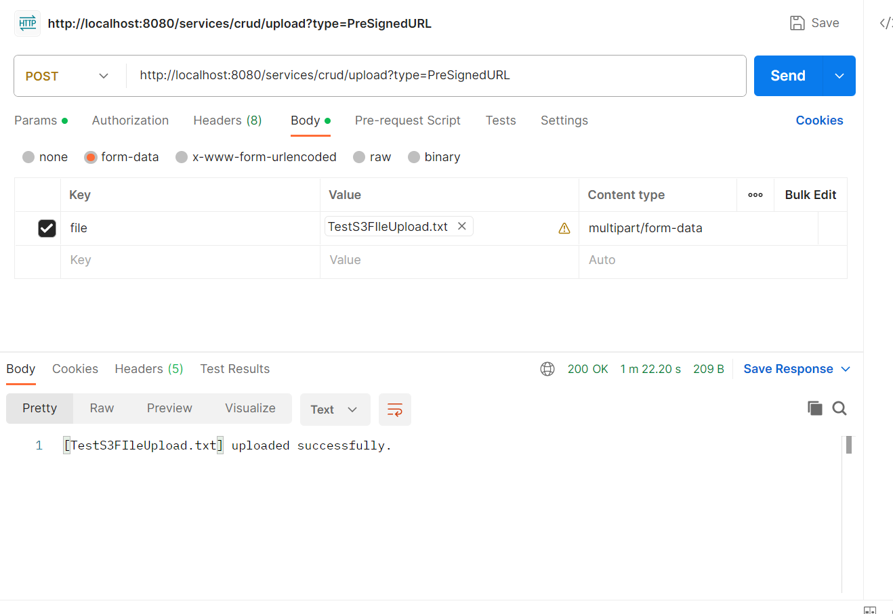

When we want to upload the files there are 2 ways to do that:

1. The first way is that the frontend will pass the file to your server via REST API and then you will call the s3 SDK to upload the file and return the result back to the frontend.

2. And the second way is something called pre-signed URLs. Pre-Signed URLs are URLs that have limited permissions and expiry.Onec the url is generated, (i.e HTTPclient Put request/ closeableHttpCient etc.. of our choice)  any client can use that URL to PUT the file directly to s3 without the need to worry about the AWS access key and secret.

If you see, in the first option File is going to your server then again going to s3 from your server. this will increase the latency because data transfer of the file is happening twice and because of that it's not recommended to use the first option. 2nd option is the best choice that we have to upload the files.

Preconditions:
1. Access Key
2. Secret
3. Region
4. Bucket name - (To upload a file we need a bucket (which is container for S3 Objects)).
This can be done through AWS console or programmatically

Bucket names must be unique across all AWS accounts in all the AWS Regions within a partition. A partition is a grouping of Regions. AWS currently has three partitions: aws (Standard Regions), aws-cn (China Regions), and aws-us-gov (AWS GovCloud (US)).

A bucket name cannot be used by another AWS account in the same partition until the bucket is deleted.

As recommended by AWS for any files larger than 100MB we should use multipart upload. There are a couple of ways to achieve this. I’ll start with the simplest approach.
One inefficiency of the multipart upload process is that the data upload is synchronous. We should be able to upload the different parts of the data concurrently.
This can be acheived by S3 multipart upload with async

This means that we are only keeping a subset of the data in memory at any point in time. This limit is configurable and can be increased if the use case requires it, but should be a minimum of 25MB.
AWS provides an id to identify this process for the next steps — uploadId. We also get an abortRuleIdin case we decide to not finish this multipart upload, possibly due to an error in the following steps.
